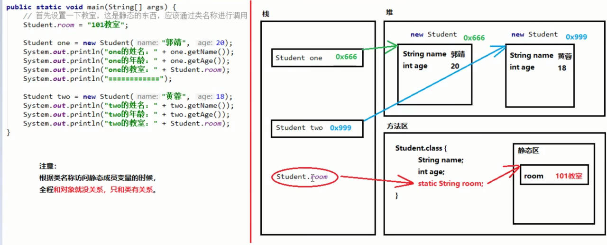

## 构造器与垃圾收集器

### 栈与堆

-   方法调用，局部变量储存在**栈**中
-   所有的对象储存在**堆**中

#### 实例变量

>   声明在类中，而不是方法中
>
>   存在于对象所属的堆上

#### 局部变量

>   声明在方法中的变量，方法参数

```java
//内存给对象分配空间，足够容纳下所有实例变量的空间（32，64位）
class instance_or_Local_variable extends father{
	//声明在类中，为实例变量
    int i = 0;
    //引用对象,只会l
    father Father = new father;
    //方法中的参数，number
    public int Local(number){
        //声明在方法中，为局部变量
        String variable = "Local";
    }
}

// 对于局部变量来说，如果可以用初始值来判断它的类型，可以用var来声明
var number = 12;
```

-   所有局部变量都存在与栈上相对应的堆栈块中
-   对象引用变量与 **primitive** 主数据类型变量都是放在栈上
-   不管是实例变量或局部变量，对象本身都会在堆上
-   实例变量控制对象的属性
-   局部变量控制行为
-   当方法执行完成后，临时变量的空间被释放（弹出）

### this访问本类

```java
1. 调用本类的成员变量   this.variable
2. 在本类的方法中，访问另一个方法  this.method
3. 在本类的构造方法中，访问本类另一个构造方法
public class Person{
	String name;
    
    public Person(){
        this(123);   // 调用本类的有参构造  在第一行，唯一性
    }
    public Person(int n){
        // 
    }
	public void sayHello(String name){
        // this.name 调用的是对象的实例变量 相当于 person.name
		System.out.println(name + "你好，我是" + this.name);
	}
}

```

## 匿名对象

```java
正常的对象
类名称 对象名 = new 类名称();
匿名对象   一次性的对象，随用随丢，随用随创建
只有右边对象，没有左边对象名和赋值运算符
new 类名称();
// 创建匿名对象
new person(); 
new.preson().name = "red";
// 与上一行的匿名函数没有关系
System.out.println(preson().name);   // null

// 使用建议，确定对象只用一次
```

```java
// 普通方式
Scanner cs = new Scanner(System.in);
int num = sc.nextInt();
// 匿名方式
int num = new Scanner(System.in).nextInt();
System.out.println("输入的是： " + num);  // 
```

```java
public static void methodParam(Scanner sc){
	int num = sc.nextInt();
	System.out.println("输入的是：" + num);
}

// 普通方式
Scanner sc = new Scanner(System.in);
methodParam(sc);

// 匿名方式
methodParam(new Scanner(System.in));
```

```java
// 普通方式
public static void methodParam(Scanner sc){
	Scanner sc = new Scanner(System.in);
	return sc;
}
// 匿名方法
public static void methodParam(Scanner sc){
    return new Scanner(System.in);
}
```

## Static

```java
// 一个类
public class Person(){
	public void person(){
		// 构造方法
		System.out.println("构造方法");
	}
	public static void method(){
		// 静态方法
		System.out.println("静态方法");
	} 
}
// 静态不能直接访问非静态
// 创建一个类时, 内存先加载静态内容, 后加载非静态内容
Person one = new Person();  
// 输出
静态方法
构造方法
// 调用静态方法时
method();  // 直接调用即可
```

```java
静态代码快
用于对静态成员变量进行赋值
static{
    // 代码ku
}
```


### 内存过程




