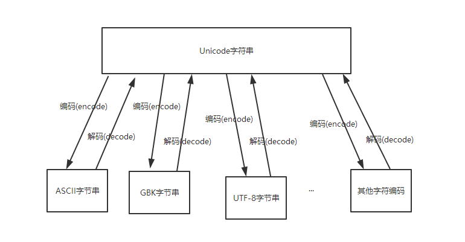

## isinstance

内置函数isinstance有两个参数，第一个参数是待检测的对象，第二个参数是对象类型，可以是单个类型，也可以是元组，返回的bool类型

如果待检测对象属于第二个参数，则返回True；否则，返回False

```python
isinstance('123', (str, float, int))
# True
isinstance(112, str)
# False
```


## **encode()和decode()**

-   **decode英文意思是 解码，encode英文原意 编码**
-   **字符串在Python内部的表示是unicode编码**，因此，在做编码转换时，通常需要以unicode作为中间编码， 即先将其他编码的字符串解码（decode）成unicode，再从unicode编码（encode）成另一种编码。
-   **decode的作用是将其他编码的字符串转换成unicode编码**，如str1.decode('gb2312')，表示将gb2312编码的字符串str1转换成unicode编码。
-   **encode的作用是将unicode编码转换成其他编码的字符串**，如str2.encode('gb2312')，表示将unicode编码的字符串str2转换成gb2312编码。
-   总得意思:想要将其他的编码转换成utf-8必须先将其解码成unicode然后重新编码成utf-8,它是以unicode为转换媒介的 如：s='中文' 如果是在utf8的文件中，该字符串就是utf8编码，如果是在gb2312的文件中，则其编码为gb2312。这种情况下，要进行编码转换，都需要先用 decode方法将其转换成unicode编码，再使用encode方法将其转换成其他编码。通常，在没有指定特定的编码方式时，都是使用的系统默认编码创建的代码文件




```python
    def add(self, index, e):
        """从后往前"""
        if not 0 <= index <= self._size:
            # 报错
            raise ValueError(
                'add failed. Require index >= 0 and index <= array sise.')
        if self._size == len(self._data):
            if self._size == 0:
                self._resize(1)
            else:
                self._resize(2 * len(self._data))
        for i in range(self._size - 1, index - 1, -1):
            self._data[i + 1] = self._data[i]
        self._data[index] = e
        self._size += 1
```


## self详解

-   内置方法`__init__`方法将此类的必有属性定义


-   __init__方法的第一参数永远是self，表示创建的类实例本身，因此，在__init__方法内部，就可以把各种属性绑定到self，因为self就指向创建的实例本身
-   有了__init__方法，在创建实例的时候，就不能传入空的参数了，必须传入与__init__方法匹配的参数，但self不需要传，Python解释器会自己把实例变量传进去：

```python
class Student(object):
    def __init__(self, name, score):
        self.name = name
        self.score = score
```

-   这里self就是指类本身，self.name就是Student类的属性变量，归Student类所有。而name是外部传来的参数，不是Student类所自带的
-   self.name = name的意思就是把外部传来的参数name的值赋值给Student类自己的属性变量self.name
-   和普通数相比，在类中定义函数只有一点不同，就是**第一参数**永远是**类的本身实例变量**`self`，并且调用时，不用传递该参数

```python
class Student(obiect):
    def __init__(self, name, score):
        self.name = name
        self.score = score
    def print_score(self):
        print "%s: %s" % (self.name, self.score)
```

让内部属性不被外部访问，可以把属性的名称前加上两个下划线，在Python中，实例的变量名如果以开头，就变成了一个私有变量（private），只有内部可以访问，外部不能访问，所以，我们把Student类改一改：

```python
class Student(object):
	def __init__(self, name, score):
    	self.__name = name
    	self.__score = score
	def print_score(self):
    	print "%s: %s" %(self.__name,self.__score)
```
从外部无法访问实例变量`.__name`和实例变量`.__score`

如果外部代码要获取name和score怎么办？可以给Student类增加get_name和get_score这样的方法：

```python
class Student(object):
    
    def set_score(self, score):
        self.__score = score
```

你会看到以一个下划线开头的实例变量名，比如_name，这样的实例变量外部是可以访问的，但是，按照约定俗成的规定，当你看到这样的变量时，意思就是，“虽然我可以被访问，但是，请把我视为私有变量，不要随意访问”


## for循环

```python
for i in range(0,10,1):
```


## Python项目

-   应创建包，再创建模块

```
_id 表示私有变量
```

类中的变量创建在构造函数中